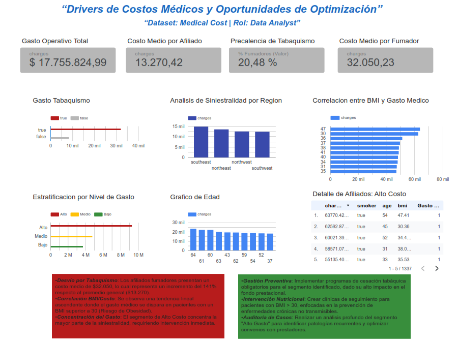

# 🏥 Health Insurance Cost Analysis: Drivers de Costos Médicos y Factores de Riesgo

## Objetivo del Proyecto
El propósito de este análisis es identificar los principales disparadores de costos en una aseguradora de salud utilizando el *Medical Cost Personal Dataset*. El enfoque principal se centró en cuantificar el impacto de los factores de riesgo modificables (tabaquismo y BMI) para proponer estrategias de optimización del gasto prestacional.

---

## Stack Tecnológico
* **SQL (BigQuery):** Procesamiento, limpieza de datos y creación de métricas personalizadas (segmentación de costos y cálculo de promedios).
* **Looker Studio:** Diseño de un dashboard interactivo para la visualización de KPIs críticos.
* **Google Cloud Storage:** Gestión de almacenamiento de los datasets originales.

---

## Estructura del Repositorio
* `queries.sql`: Contiene el código SQL utilizado para el análisis y la estructuración de la Master Table.
* `images/`: Capturas de pantalla del dashboard final.
* `data/`: Información sobre el origen de los datos.

---

## 🔍 Análisis Realizado
A través de una **Master Query en SQL**, se realizaron los siguientes procesos:
1. **Segmentación de Pacientes:** Clasificación por niveles de gasto (Bajo, Medio, Alto).
2. **Impacto del Tabaquismo:** Comparativa de siniestralidad entre fumadores y no fumadores.
3. **Análisis de BMI:** Correlación entre el Índice de Masa Corporal y el costo médico medio.
4. **Distribución Geográfica y Etaria:** Identificación de patrones de gasto por regiones y rangos de edad.

---

## Insights Clave
* **Factor Tabaquismo:** Los afiliados fumadores presentan un costo medio de **$32,050**, lo que representa un incremento del **141%** respecto al promedio general ($13,270).
* **Impacto del BMI:** Se observa una tendencia lineal ascendente donde el gasto médico se dispara significativamente en pacientes con un **BMI superior a 30** (Riesgo de Obesidad).
* **Concentración del Gasto:** El segmento de **Alto Costo** concentra la mayor parte de la siniestralidad del fondo, requiriendo intervención inmediata.

---

## Recomendaciones Estratégicas
* **Gestión Preventiva:** Implementar programas de cesación tabáquica dirigidos específicamente al segmento identificado.
* **Intervención Nutricional:** Crear clínicas de seguimiento para pacientes con BMI > 30, enfocadas en la prevención de enfermedades crónicas.
* **Optimización de Recursos:** Aplicar la segmentación para priorizar auditorías médicas en los perfiles de alto riesgo financiero.

---

## Dashboard Interactivo
> (https://lookerstudio.google.com/s/s_yxizDE9So)

---

## 👤 Sobre mí
Soy estudiante de **Lic. en Nutrición en la UNLP** (Argentina) con orientación en **Data Science**.
Mi objetivo es combinar la evidencia clínica con el análisis de datos para mejorar la toma de decisiones en el sector salud (HealthTech).
Soy estudiante de **Lic. en Nutrición en la UNLP** (Argentina) con orientación en **Data Science**. Mi objetivo es combinar la evidencia clínica con el análisis de datos para mejorar la toma de decisiones en el sector salud (HealthTech).

---
